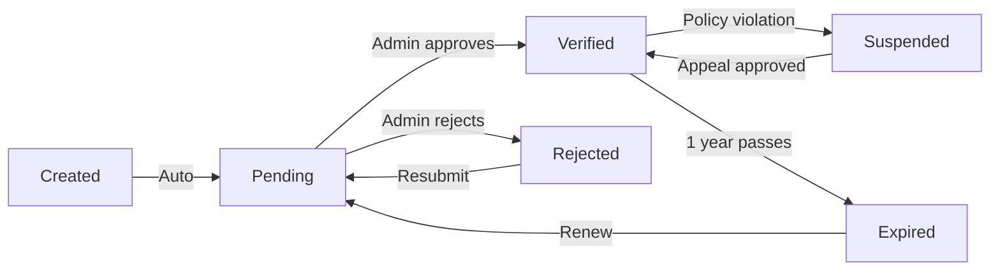

# 16 - Trust System Design

## Core Philosophy

**Trust is the product.**

Faith Connect isn't competing on features or price. It's competing on trust. Every design decision must answer: "Does this increase trust?"

---

## Trust Architecture

### Three Pillars of Trust

```
1. VERIFICATION (Authority)
   └─ Church leadership approves businesses
   
2. TRANSPARENCY (Visibility)
   └─ Clear badges, public verification status
   
3. ACCOUNTABILITY (Governance)
   └─ Audit trails, moderation, reporting
```

---

## 1. Verification System

### Verification States

```
pending     → Business submitted, awaiting review
verified    → Approved by church admin
rejected    → Not approved (with reason)
suspended   → Temporarily disabled (policy violation)
expired     → Verification needs renewal (annual)
```

### State Transitions



### Verification Workflow

#### Step 1: Business Owner Requests
```json
POST /verification/request
{
  "business_id": "business-uuid",
  "documents": [
    "media-uuid-1",  // Church membership card
    "media-uuid-2"   // Business registration certificate
  ],
  "church_leader_reference": {
    "name": "Pastor Muturi",
    "phone": "0722000000",
    "relationship": "Church elder, knows business owner"
  },
  "notes": "Been a member for 5 years, active in men's fellowship"
}
```

#### Step 2: Admin Reviews
```
GET /admin/verifications?status=pending

[
  {
    "id": "verification-uuid",
    "business": {
      "name": "Kitisons Auto Spares",
      "owner": "Sheila Muriithi"
    },
    "submitted_at": "2024-12-20T10:00:00Z",
    "documents": [...],
    "reference": {...},
    "notes": "..."
  }
]
```

#### Step 3: Admin Decision
```json
POST /admin/verifications/{id}/approve
{
  "badge_type": "church_verified",
  "notes": "Verified by Pastor Muturi on 20/12/2024",
  "valid_until": "2025-12-20"
}

// Or reject:
POST /admin/verifications/{id}/reject
{
  "reason": "Could not verify church membership",
  "feedback": "Please provide updated membership card"
}
```

#### Step 4: Business Receives Badge
Automatic:
- Badge appears on business profile
- Email notification sent
- Trust score updated (+40 points)

---

## 2. Trust Badges

### Badge Types

#### 🕊️ Church Verified
**Criteria:** Approved by church admin
**Value:** Member of FEM Family Church, identity confirmed
**Validity:** 1 year, renewable
**Display:** Primary badge, always visible

#### 🤝 Community Recommended
**Criteria:** 10+ positive reviews from verified church members
**Value:** Highly rated by community
**Validity:** Ongoing (can be lost if rating drops)
**Display:** Secondary badge

#### ⭐ Trusted Provider
**Criteria:** 50+ completed transactions, 4.5+ rating, 6+ months active
**Value:** Proven track record
**Validity:** Ongoing
**Display:** Premium badge

#### 🌱 New Member
**Criteria:** Account < 30 days old
**Value:** Transparency about newness
**Validity:** 30 days
**Display:** Small badge, auto-expires

### Badge Data Model

```python
class TrustBadge:
    id: UUID
    business_id: UUID
    badge_type: BadgeType  # Enum
    
    # Issuance
    issued_by: UUID  # Admin user or "system"
    issued_at: datetime
    
    # Validity
    valid_until: datetime | None  # None = permanent
    status: BadgeStatus  # active, expired, revoked
    
    # Context
    reason: str  # Why badge was granted
    notes: str | None  # Admin notes
    
    # Audit
    revoked_by: UUID | None
    revoked_at: datetime | None
    revocation_reason: str | None
```

### Badge UI Examples

**Business Card (Directory):**
```
┌─────────────────────────────┐
│ [Logo] Kitisons Auto Spares │
│ 🕊️ Church Verified          │
│ Transportation • Wangige    │
│ ⭐⭐⭐⭐⭐ (12 reviews)        │
│ From KSh 5,000              │
└─────────────────────────────┘
```

**Business Detail Page:**
```
Trust & Verification
────────────────────
🕊️ Church Verified
   Verified by FEM Family Church on Dec 20, 2024
   Valid until Dec 20, 2025
   
🤝 Community Recommended
   Earned through 15 positive reviews from church members
   
Profile Completeness: 95%
Trust Score: 87/100
```

---

## 3. Trust Score Algorithm

### Score Calculation (0-100)

```python
def calculate_trust_score(business: Business) -> int:
    score = 0
    
    # 1. Verification Status (40 points max)
    if business.verification_status == "verified":
        score += 40
        # Bonus for multiple verification types
        verified_badges = business.badges.filter(status="active")
        score += min(len(verified_badges) - 1, 5) * 2  # +2 per extra badge, max +10
    elif business.verification_status == "pending":
        score += 10  # Credit for trying
    
    # 2. Profile Completeness (20 points max)
    completeness = calculate_completeness(business)
    score += int(completeness * 20)
    
    # 3. Community Engagement (25 points max)
    review_score = min(business.review_count / 20, 1) * 15  # Max at 20 reviews
    rating_score = (business.avg_rating or 0) / 5 * 10      # Max at 5 stars
    score += int(review_score + rating_score)
    
    # 4. Time Active (15 points max)
    days_active = (now() - business.created_at).days
    age_score = min(days_active / 180, 1) * 15  # Max at 6 months
    score += int(age_score)
    
    # Penalties
    if business.has_unresolved_reports:
        score -= 20
    if business.response_time_hours > 48:
        score -= 10
    
    return max(0, min(100, score))  # Clamp to 0-100

def calculate_completeness(business: Business) -> float:
    """Returns 0.0 to 1.0"""
    required_fields = [
        business.name,
        business.description,
        business.category_id,
        business.contact.phone,
        business.location.city,
        business.logo_id,
    ]
    optional_fields = [
        business.contact.email,
        business.contact.website,
        business.location.address,
        business.gallery_ids,
    ]
    
    required_filled = sum(1 for f in required_fields if f)
    optional_filled = sum(1 for f in optional_fields if f)
    
    return (required_filled / len(required_fields)) * 0.7 + \
           (optional_filled / len(optional_fields)) * 0.3
```

### Score Display

**Never show raw score to users** (feels gamified).

Instead show:
- Trust badges (visual)
- Profile completeness % (actionable)
- Time as member (social proof)

Raw score is for:
- Admin dashboard
- Search ranking algorithm
- Fraud detection

---

## 4. Transparency Features

### Public Verification Log

Each business detail page shows:

```
Verification History
────────────────────
✅ Dec 20, 2024 - Church Verified
   Approved by Admin (Pastor M.)
   
✅ Nov 15, 2024 - Profile Completed
   Owner uploaded all required documents
   
✅ Oct 1, 2024 - Business Created
   Partnership #: FEM12345
```

### Review Authenticity Indicators

```
Review by Emmanuel K.
🕊️ Verified Church Member
Partnership: FEM67890
Member since: 2022

"Excellent service, highly recommend"
⭐⭐⭐⭐⭐

15 people found this helpful
```

---

## 5. Accountability & Moderation

### Report System

```json
POST /reports
{
  "entity_type": "business",  // or "review", "user"
  "entity_id": "business-uuid",
  "reason": "misleading_info",  // Enum
  "details": "Business claims church verification but is not verified",
  "reporter_id": "user-uuid"
}
```

### Admin Moderation Queue

```
GET /admin/reports?status=pending

{
  "reports": [
    {
      "id": "report-uuid",
      "entity": {
        "type": "business",
        "name": "Kitisons Auto Spares"
      },
      "reason": "misleading_info",
      "details": "...",
      "reporter": {
        "partnership": "FEM67890",
        "verified": true
      },
      "submitted_at": "2024-12-20T10:00:00Z",
      "priority": "high"  // Based on reporter trust + severity
    }
  ]
}
```

### Admin Actions

```json
POST /admin/reports/{id}/resolve
{
  "action": "suspend_business",  // or "warn", "dismiss", "ban_user"
  "resolution": "Business suspended for 7 days pending investigation",
  "notify_parties": true
}
```

### Audit Trail

Every trust-related action is logged:

```python
class TrustAuditLog:
    id: UUID
    action_type: str  # "verification_approved", "badge_issued", etc.
    actor_id: UUID    # Admin who performed action
    target_id: UUID   # Business/user affected
    changes: dict     # Before/after state
    reason: str
    timestamp: datetime
    ip_address: str
```

---

## 6. Trust-Driven Features

### Search Ranking

Businesses sorted by trust score (when equal on relevance):

```sql
SELECT * FROM businesses
WHERE category_id = ? AND city = ?
ORDER BY 
  verification_status = 'verified' DESC,
  trust_score DESC,
  created_at DESC
```

### Featured Listings (Paid)

Can only purchase if:
- ✅ Verified status
- ✅ Trust score > 70
- ✅ No unresolved reports

### Review Weighting

Verified members' reviews count more:

```python
def calculate_weighted_rating(reviews: list[Review]) -> float:
    total_weight = 0
    weighted_sum = 0
    
    for review in reviews:
        weight = 1.5 if review.user.is_verified else 1.0
        weighted_sum += review.rating * weight
        total_weight += weight
    
    return weighted_sum / total_weight if total_weight > 0 else 0
```

---

## 7. Trust Communication

### Email Templates

**Verification Approved:**
```
Subject: 🎉 Your business is now Church Verified!

Hi Sheila,

Great news! Kitisons Auto Spares has been verified by FEM Family Church.

Your business now displays the 🕊️ Church Verified badge, which shows 
customers you're a trusted member of our faith community.

Benefits:
- Higher visibility in search results
- Featured in "Verified Businesses" section
- Eligible for premium placement

Keep up the great work!

[View Your Business Profile]
```

**Verification Rejected:**
```
Subject: Update needed for verification request

Hi Sheila,

We reviewed your verification request for Kitisons Auto Spares.

To complete verification, we need:
- Updated church membership card (current one expired)
- Contact Pastor Muturi at 0722000000 for reference

You can resubmit anytime:
[Update Verification Request]

Questions? Reply to this email.
```

---

## 8. Trust Metrics Dashboard (Admin)

### Key Metrics

```
Trust Health Overview
─────────────────────
Verification Rate: 68% (85 of 125 businesses)
Avg Trust Score: 72/100
Pending Verifications: 12
Unresolved Reports: 3 (all low priority)

Recent Activity:
- 5 businesses verified this week
- 23 reviews from verified members
- 2 badges revoked (expired)
```

### Trust Trends

```
Trust Score Distribution
────────────────────────
90-100: ████████ 15 businesses
80-89:  ████████████ 28 businesses
70-79:  ██████████████ 35 businesses
60-69:  ████████ 20 businesses
<60:    ████ 10 businesses

Action: Focus on moving <60 businesses to 70+
```

---

## 9. User Education

### Trust Badge Explainers

When user clicks badge:

```
┌─────────────────────────────────┐
│ 🕊️ Church Verified              │
├─────────────────────────────────┤
│ This business has been verified │
│ by FEM Family Church leadership.│
│                                 │
│ Verification confirms:          │
│ • Owner is church member        │
│ • Business information accurate │
│ • Church leadership endorsement │
│                                 │
│ Verified: Dec 20, 2024          │
│ Valid until: Dec 20, 2025       │
└─────────────────────────────────┘
```

### FAQ Section

**Q: What does "Church Verified" mean?**
A: It means a church leader has confirmed the business owner is a member in good standing and the business information is accurate.

**Q: Can I trust non-verified businesses?**
A: All businesses on Faith Connect are from our church community. Verification adds an extra layer of confirmation, but new businesses may be pending verification.

**Q: How do I get my business verified?**
A: Go to your business dashboard and click "Request Verification". A church admin will review within 3 business days.

---

## 10. Implementation Checklist

### Database
- [ ] Add `verification_status` enum to businesses table
- [ ] Create `trust_badges` table
- [ ] Create `trust_audit_logs` table
- [ ] Create `verification_requests` table
- [ ] Add `trust_score` computed field
- [ ] Add indexes for trust-based queries

### Backend
- [ ] Verification request endpoint
- [ ] Admin approval/rejection endpoints
- [ ] Badge issuance logic
- [ ] Trust score calculation function
- [ ] Verification email notifications
- [ ] Audit logging for all trust actions

### Admin Dashboard
- [ ] Pending verifications list
- [ ] Verification review interface
- [ ] Badge management UI
- [ ] Reports moderation queue
- [ ] Trust metrics dashboard
- [ ] Audit log viewer

### Frontend
- [ ] Badge display components
- [ ] Verification request form
- [ ] Trust score display (admin only)
- [ ] Profile completeness indicator
- [ ] Badge tooltip explainers
- [ ] Verification history timeline

### Testing
- [ ] Verification workflow end-to-end
- [ ] Badge issuance and display
- [ ] Trust score calculation accuracy
- [ ] Admin moderation flows
- [ ] Email notifications

---

## Success Metrics

### 30 Days Post-Launch
- 50%+ of businesses verified
- 90%+ user awareness of trust badges
- <24 hour verification turnaround time
- 0 false verifications

### 90 Days Post-Launch
- 80%+ of businesses verified
- Trust score avg moves from 72 → 80
- 5+ church leaders trained as verifiers
- Trust-driven features driving engagement

---

## Future Enhancements

### Phase 2 (Months 3-6)
- **Multi-church federation:** Verify businesses from other churches
- **Peer endorsements:** Let verified members vouch for businesses
- **Trust-based credit:** Use trust score for lending decisions

### Phase 3 (Months 6-12)
- **Decentralized verification:** Blockchain-based verification records
- **Trust portability:** Use Faith Connect trust score on other platforms
- **Insurance partnerships:** Lower premiums for high-trust businesses

---

## Conclusion

Trust is not a feature you add — it's the foundation you build on.

Every database table, API endpoint, and UI component in Faith Connect should reinforce trust. When users see 🕊️ Church Verified, they should feel:

✅ "This person is part of my community"
✅ "A church leader vouched for them"
✅ "I can trust this business"

That feeling is the product.

---

_The trust system is live when verified businesses feel proud to display badges and customers actively seek them out._